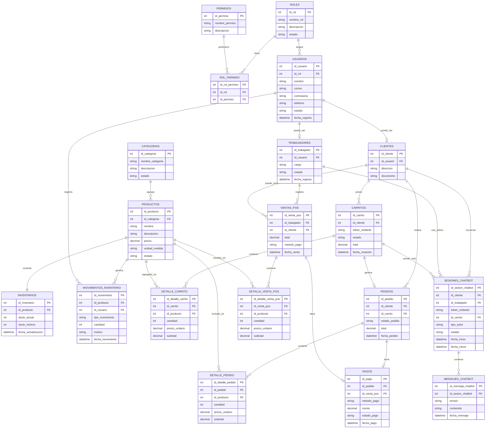

```mermaid
erDiagram

    ROLES {
        int id_rol PK
        string nombre_rol
        string descripcion
        string estado
    }

    PERMISOS {
        int id_permiso PK
        string nombre_permiso
        string descripcion
    }

    ROL_PERMISO {
        int id_rol_permiso PK
        int id_rol FK
        int id_permiso FK
    }

    USUARIOS {
        int id_usuario PK
        int id_rol FK
        string nombre
        string correo
        string contrasena
        string telefono
        string estado
        datetime fecha_registro
    }

    CLIENTES {
        int id_cliente PK
        int id_usuario FK
        string direccion
        string documento
    }

    TRABAJADORES {
        int id_trabajador PK
        int id_usuario FK
        string cargo
        string estado
        datetime fecha_ingreso
    }

    CATEGORIAS {
        int id_categoria PK
        string nombre_categoria
        string descripcion
        string estado
    }

    PRODUCTOS {
        int id_producto PK
        int id_categoria FK
        string nombre
        string descripcion
        decimal precio
        string unidad_medida
        string estado
    }

    INVENTARIOS {
        int id_inventario PK
        int id_producto FK
        int stock_actual
        int stock_minimo
        datetime fecha_actualizacion
    }

    MOVIMIENTOS_INVENTARIO {
        int id_movimiento PK
        int id_producto FK
        int id_usuario FK
        string tipo_movimiento
        int cantidad
        string motivo
        datetime fecha_movimiento
    }

    CARRITOS {
        int id_carrito PK
        int id_cliente FK
        string token_visitante
        string estado
        decimal total
        datetime fecha_creacion
    }

    DETALLE_CARRITO {
        int id_detalle_carrito PK
        int id_carrito FK
        int id_producto FK
        int cantidad
        decimal precio_unitario
        decimal subtotal
    }

    PEDIDOS {
        int id_pedido PK
        int id_cliente FK
        int id_carrito FK
        string estado_pedido
        decimal total
        datetime fecha_pedido
    }

    DETALLE_PEDIDO {
        int id_detalle_pedido PK
        int id_pedido FK
        int id_producto FK
        int cantidad
        decimal precio_unitario
        decimal subtotal
    }

    PAGOS {
        int id_pago PK
        int id_pedido FK
        int id_venta_pos FK
        string metodo_pago
        decimal monto
        string estado_pago
        datetime fecha_pago
    }

    VENTAS_POS {
        int id_venta_pos PK
        int id_trabajador FK
        int id_cliente FK
        decimal total
        string metodo_pago
        datetime fecha_venta
    }

    DETALLE_VENTA_POS {
        int id_detalle_venta_pos PK
        int id_venta_pos FK
        int id_producto FK
        int cantidad
        decimal precio_unitario
        decimal subtotal
    }

    SESIONES_CHATBOT {
        int id_sesion_chatbot PK
        int id_cliente FK
        int id_trabajador FK
        string token_visitante
        int id_carrito FK
        string tipo_actor
        string estado
        datetime fecha_inicio
        datetime fecha_cierre
    }

    MENSAJES_CHATBOT {
        int id_mensaje_chatbot PK
        int id_sesion_chatbot FK
        string emisor
        string contenido
        datetime fecha_mensaje
    }

    ROLES ||--o{ USUARIOS : asigna
    ROLES ||--o{ ROL_PERMISO : tiene
    PERMISOS ||--o{ ROL_PERMISO : pertenece

    USUARIOS ||--o| CLIENTES : puede_ser
    USUARIOS ||--o| TRABAJADORES : puede_ser

    CATEGORIAS ||--o{ PRODUCTOS : agrupa
    PRODUCTOS ||--|| INVENTARIOS : controla
    PRODUCTOS ||--o{ MOVIMIENTOS_INVENTARIO : genera
    USUARIOS ||--o{ MOVIMIENTOS_INVENTARIO : registra

    CLIENTES ||--o{ CARRITOS : posee
    CARRITOS ||--o{ DETALLE_CARRITO : contiene
    PRODUCTOS ||--o{ DETALLE_CARRITO : agregado_en

    CLIENTES ||--o{ PEDIDOS : realiza
    CARRITOS ||--o| PEDIDOS : genera
    PEDIDOS ||--o{ DETALLE_PEDIDO : contiene
    PRODUCTOS ||--o{ DETALLE_PEDIDO : incluido_en
    PEDIDOS ||--o| PAGOS : tiene

    TRABAJADORES ||--o{ VENTAS_POS : registra
    CLIENTES ||--o{ VENTAS_POS : puede_tener
    VENTAS_POS ||--o{ DETALLE_VENTA_POS : contiene
    PRODUCTOS ||--o{ DETALLE_VENTA_POS : vendido_en
    VENTAS_POS ||--o| PAGOS : tiene

    CLIENTES ||--o{ SESIONES_CHATBOT : conversa
    TRABAJADORES ||--o{ SESIONES_CHATBOT : usa_admin
    CARRITOS ||--o{ SESIONES_CHATBOT : puede_usar
    SESIONES_CHATBOT ||--o{ MENSAJES_CHATBOT : contiene
```
